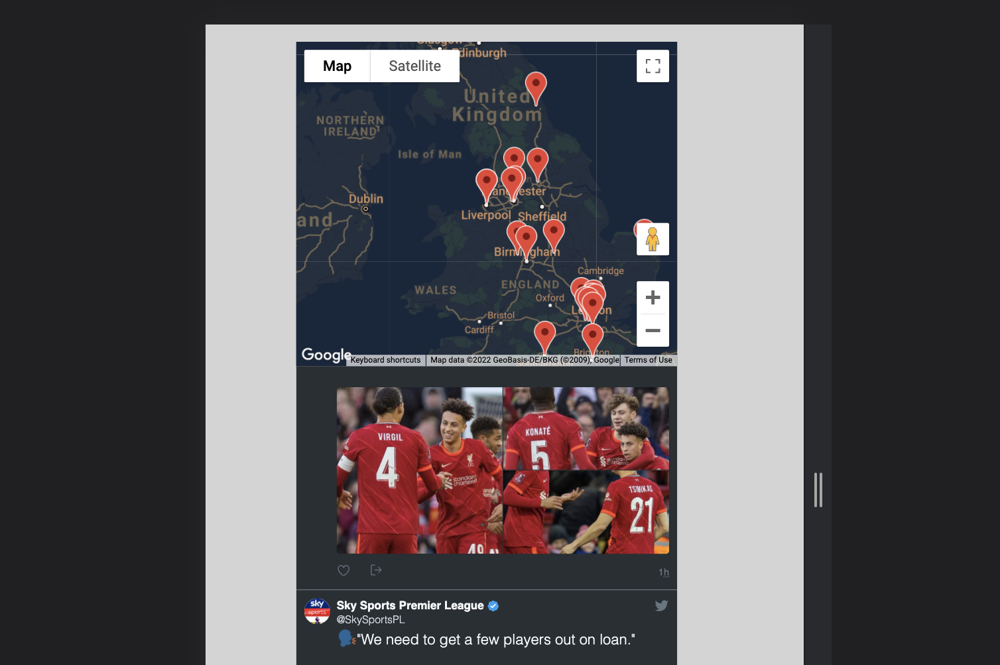
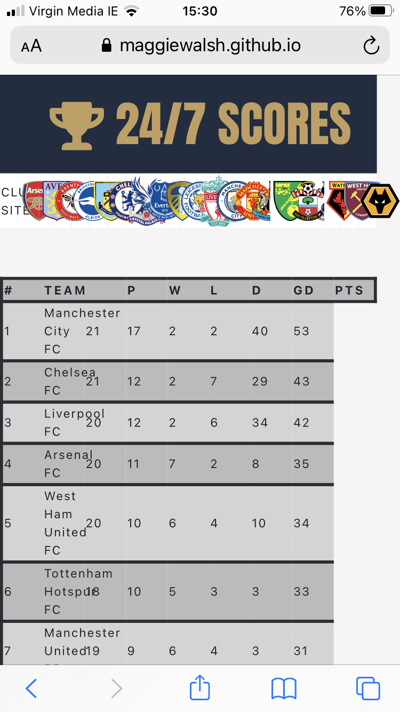

# 24/7 Scores

I created this website for the 2nd Milestone Project on Interactive Frontend, at Code Institute's Diploma in Software Development course. 

Visit the live [website.](https://maggiewalsh.github.io/24-7-Scores/)

I wanted to create a website for fans of the English Premier League, where they could find a table of the current standings, along with a live Twitter feed for top news stories.


# Table of Contents
  * [UX and UI](#ux-and-ui)
    * [Project Research](#project-research)
        + [Research Analysis](#research-analysis)
    * [Persona and Their Goals](#persona-and-their-goals)
    * [Owner Goals](#owner-goals)
    * [User Stories](#user-stories)
    * [Wireframes](#wireframes)
  * [Design](#design)
    * [Colour Scheme](#colour-scheme)
    * [Favicon](#favicon)
    * [Typography](#typography)
    * [Layout](#layout)
  * [Features](#features)
    * [Existing Features](#existing-features)
    * [Features to be Implemented in Future](#features-to-be-implemented-in-future)
  * [Technologies Used](#technologies-used)
    * [Languages](#languages)
    * [Frameworks and Libraries](#frameworks-and-libraries)
  * [Testing](#testing)
    * [Manual Testing](#manual-testing)
    * [Additional Testing](#additional-testing)
    * [Resolved Bugs](#resolved-bugs)
  * [Deployment](#deployment)
    * [Forking a GitHub Repository](#forking-a-github-repository)
    * [Forking a GitHub Repository](#forking-a-github-repository)
    * [Cloning a repository using the command line](#cloning-a-repository-using-the-command-line)
  * [Credits](#credits)
    * [Imagery](#imagery)
    * [Code](#code)
    * [Acknowledgements](#acknowledgements)

<small><i><a href='http://ecotrust-canada.github.io/markdown-toc/'>Table of contents generated with markdown-toc</a></i></small>

# UX and UI

  * ## Project Research

    As an avid football fan, I wanted to create a website that I would like to use myself to keep up to date with football news.

    * ## Research Analysis

      People appreciate not having to jump between multiple sites to get different information relating to their interests. One place to get all the latest updates is what people are looking for. 

  * ## Persona and Their Goals

    * The ideal visitor to this website is a football fan.

    * They are looking for current league standings. 

    * They want to know what teams are currently in position to qualify for certain tournaments, and what teams are in the relegation zone.
    
    * They are looking for up-to-date news on the English premier league.
    
    * They want to know all the teams currently in the league, and where they are located.

    * They want to be able to navigate to their own teams website with ease, from this website.

  * ## Owner Goals
    1. Increase traffic to the site.
    2. Keep existing visitors interested.
    3. Become a go-to website for football updates.
  * ## User Stories
    1. As a user visiting the site for the first time, I want to navigate the site intuitively.
    2. As a user, I want to know what information this site provides.
    3. As a user, I want to be able to see the current league table.
    4. As a user, I want to be able to keep up-to-date with football news on Twitter.
    5. As a user, I want to find something with a bit of humour.
    6. As a user, I want to be able to access your social media accounts.
  * ## Wireframes
    * Wireframe available [here.](docs/desktop-wireframe.pdf)
  * ## Design
    * ## Colour Scheme
      I wanted a rich colour palette for this website. I went with a palette inspired by an old football kit from the noughties. 
      
      I wanted a clean background to allow the sites features to stand out. I used the [Adobe](https://www.adobe.com/ie/creativecloud.html) website to generate a [colour](docs/color-palette.jpeg). This meant that the colours complimented each other nicely. 
    * ## Favicon 
      I used the [Favicon.io](https://favicon.io/) website to create a favicon for my website. I wanted to continue with the rich theme, so I kept the background colour the same as the header and footer sections. I used the same font for the headings and logo and left it as a simple '24/7', so as not to be too busy.
    * ## Typography
      I wanted a simple font for the website. I liked the contrast between the font for the headings which is Anton, and the font for the rest of the website.
    * ## Layout
      I decided on a single-page website because I felt like all the components flow nicely into eachother. I opted for a larger than 'standard' footer as I feel like a more substantial footer looks better.
  * ## Features
    * ## Existing Features
      * The website has the following features from top to bottom :
        * Logo - 24/7 Scores - Clean font. Simple and descriptive about the purpose of the website.

          

        * Content - At the top of the site there is a table of all the premier league teams. They are identified by their club badges. Each badge has a link that opens a new tab with the relevant teams home website.

          

          Next there is a table with the current league standings. This contains the team name, position, games played, games won, games lost, games drawn, goal difference and points.

          

          Below this there is a funny football quote generator. When you click 'New Quote', a new quote is generated.

          

          Below this is a map which shows all the locations of the premier league stadiums. When you click on a marker an information window pops open to give a brief description.

          

          To the right is an embedded Twitter feed containing top Premier League Twitter accounts, from clubs to reporters and players to fan.

          

        * Footer - The footer contains the website name and a brief description of the purpose of the website. 

          

    * ## Features to be Implemented in Future
      * Ability to choose other football leagues around the world i.e La Liga, Ligue 1, Bundesliga etc.
      * Table with upcoming matches.
      * Form from last five matches added to league table.
      * Player stats.
      * Football top news stories API.
      * Functionality to login and remember your preferences.
  * ## Technologies Used
    * ## Languages
      * [HTML5](https://en.wikipedia.org/wiki/HTML5)
      * [CSS](https://en.wikipedia.org/wiki/CSS)
      * [JavaScript](https://en.wikipedia.org/wiki/JavaScript)
    * ## Frameworks and Libraries
      * [Bootstrap v.5](https://getbootstrap.com/docs/5.0/getting-started/introduction/)
      * [!bcdn5](https://marketplace.visualstudio.com/items?itemName=eventyret.bootstrap-4-cdn-snippet) extension
      * [Google Fonts](https://fonts.google.com/)
      * [Font Awesome](https://fontawesome.com/)
      * [Adobe](https://www.adobe.com/ie/creativecloud.html)
      * [Favicon.io](https://favicon.io)
      * [Balsamiq](https://balsamiq.com/)
      * [VS Code](https://code.visualstudio.com/)
      * [GitHub](https://github.com/)
      * [Autoprefixer](https://autoprefixer.github.io/)
      * [Am I Responsive](http://ami.responsivedesign.is/)
  * ## Testing
    Testing for this website was done using the Google Chrome Browser, using Chrome Developer Tools to check the different screensizes. Testing was also done on an iPhone 8 using Safari, as sometimes Safari can cause issues with how the website renders. No such errors were found.
    * ## User Stories Testing
      1. As a user visiting the site for the first time, I want to navigate the site intuitively.
         * A user can navigate around the site with ease. All components work as they should.
      2. As a user, I want to know what information this site provides.
         * A user can immediately see that there are multiple components to the page, league standings, twitter feed, map, quote generator and links to Premier League club websites. There is also a short summary of the purpose of the site in the footer.
      3. As a user, I want to be able to see the current League Table.
         * A user can clearly see that the league table is the most prominent component of the website.
      4. As a user, I want to be able to keep up-to-date with football news on Twitter.
         * A user can view a live TWitter feed along the right-hand side of the site, on desktop. On mobile it is pushed to the bottom of the siye.
      5. As a user, I want to find something with a bit of humour.
         * A user can generate funny quotes from the Funny Quote Generator below the League Table
      6. As a user, I want to be able to access your social media accounts.
         * A user can access the companies social media links via the footer.
    * ## Manual Testing 
      * Club Sites
        * Club badges are visible.
        * Each badge serves as a link to the respective clubs home website, which opens in a new tab.
        * If error occurs with data loading, error message appears.
        * Hover effect works on badges.
        * Club Sites are removed on screen size 767px and smaller.
      * League Table
        * While data is loading, spinner appears.
        * Data loads into table in the correct order.
        * If error occurs with data loading, error message appears.
        * Title attribute provides explanation for headings that are shortened
      * Funny Quotes
        * Quote is generated on page load.
        * Quote is generated when 'New Quote' button is clicked.
      * Map
        * Loads correctly.
        * Displays markers for location of stadium for each Premier League Team.
        * When a marker is clicked an information window pops open to give the name of the stadium, and the club whose homeground it is.
      * Twitter Feed
        * Loads data.
        * Is restricted to 3 tweets to keep the flow of the page.
        * Clicking on a Tweet brings you to Twitter, which opens in a new tab.
      * Footer
        * Social icons open links in new tabs.
        * 24/7-Scores.com link reloads page.
    * ## Additional Testing 
      * [W3C - Jigsaw Validator](https://jigsaw.w3.org/css-validator/)

      * [W3C - NU HTML Checker](https://validator.w3.org/nu/)

      * [JSHint - HTML Validator](https://jshint.com/)
    * ## Resolved Bugs
      * I originally started this project with another [repository](https://github.com/MaggieWalsh/24-7_Scores). An error occured which resulted in me having to merge, and pull despite never intending to. The matter was unresolveable given the timeframe and my knowledge restrictions. I made the decision to begin again, with a new repository. I will leave the original unedited in order for it to be checked.

      * I noticed stray ```, _``` in some places on my code. I eventually figured out that it was because of whitespace in my code. Which resolved once I deleted it.

      * My map and Twitter feed were overlapping eachother. This resolved it:
      ```
        .col-lg-8 {
        display: grid; 
        grid-template-rows: 1fr 0.3fr 1fr;
        }
        
     

      * The table was rendering strangely. In order to fix this I removed the fixed position which allowed the data to fit into the table correctly.

    

      * In order to improve accessibility, I added *aria labels* to all non-text links.

      * In order to improve accessibility, I added *aria-hidden true* to Font Awesome icons that were not fucntional.

      * In order to improve best practices, I added *rel-noopener* to the untrusted external links.

  * ## Deployment

     I chose to create this project in VS Code rather than Gitpod. This is why there is no instructions related to Gitpod.
  
      1. On GitHub, navigate to your site's repository.
      2. Under your repository name, click  *Settings*.
      3. In the left sidebar, click Pages.
      Page tab in the left-hand sidebar
      4. Under "GitHub Pages", use the *None* or *Branch* drop-down menu and select a publishing source.
      5. Optionally, use the drop-down menu to select a folder for your publishing source.
      6. Click Save.

  * ## Forking a GitHub Repository
      1. Login to GitHub.
      2. Locate your desired repository.
      3. Locate the fork option in the top-right hand corner of the repository page.    
      4. You will be asked where you want to fork it to.

  * ## Cloning a repository using the command line
      1. On GitHub, navigate to the main page of the repository.
      2. Above the list of files, click download code.
      3. To clone the repository using HTTPS, under "Clone with HTTPS", click clipboard icon. To clone the repository using an SSH key, including a certificate issued by your organization's SSH certificate authority, click *Use SSH*, then click clipboard icon. To clone a repository using GitHub CLI, click Use *GitHub CLI*, then click clipboard icon.
      4. Open Terminal.
      5. Change the current working directory to the location where you want the cloned directory.
      6. Type ```git clone```, and then paste the URL you copied earlier.

           ```
           $ git clone https://github.com/YOUR-USERNAME/YOUR-REPOSITORY
           ```

      7. Press Enter to create your local clone.

          ```
          $ git clone https://github.com/YOUR-USERNAME/YOUR-REPOSITORY
          ```

  * ## Credits
    * ## Code
      * Bootstrap helped structure the website in order to ensure it's responsivity.
      * All code is my own unless explicitly stated in my code files in a comment.
      * Credit to [MDB](https://mdbootstrap.com/) for the footer that I adapted.
      * Credit to Stack Overflow for some solutions that I have commented in my code.
    * ## Acknowledgements
      * A very special thank you to my mentor Richard Wells.  
      * Thanks to my peers in my Discord group, who reviewed my project and pointed out a bug that wasn't visible on any of my own tests.


