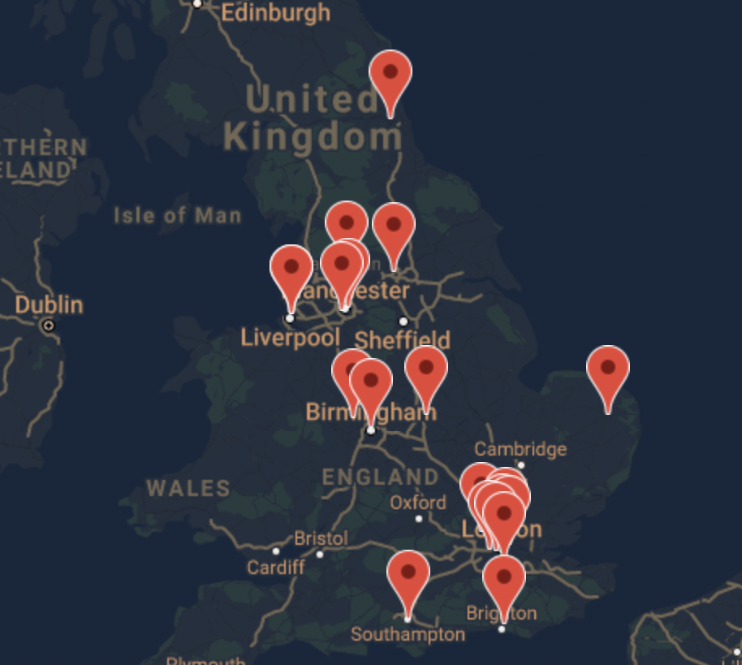

# 24/7 Scores

I created this website for the 2nd Milestone Project on Interactive Frontend, at Code Institute's Diploma in Software Development course. 

Visit the live [website.](https://maggiewalsh.github.io/24-7-Scores/)

I wanted to create a website for fans of the English Premier League, where they could find a table of the current standings, along with a live Twitter feed for top news stories.


# Table of Contents
  * [UX and UI](#ux-and-ui)
    * [Project Research](#project-research)
        + [Research Analysis](#research-analysis)
    * [Persona and Their Goals](#persona-and-their-goals)
    * [Owner Goals](#owner-goals)
    * [User Stories](#user-stories)
    * [Wireframes](#wireframes)
  * [Design](#design)
    * [Colour Scheme](#colour-scheme)
    * [Favicon](#favicon)
    * [Typography](#typography)
    * [Layout](#layout)
  * [Features](#features)
    * [Existing Features](#existing-features)
    * [Features to be Implemented in Future](#features-to-be-implemented-in-future)
  * [Technologies Used](#technologies-used)
    * [Languages](#languages)
    * [Frameworks and Libraries](#frameworks-and-libraries)
  * [Testing](#testing)
    * [Manual Testing](#manual-testing)
    * [Additional Testing](#additional-testing)
    * [Resolved Bugs](#resolved-bugs)
  * [Deployment](#deployment)
    * [Forking a GitHub Repository](#forking-a-github-repository)
    * [Forking a GitHub Repository](#forking-a-github-repository)
    * [Cloning a repository using the command line](#cloning-a-repository-using-the-command-line)
  * [Credits](#credits)
    * [Imagery](#imagery)
    * [Code](#code)
    * [Acknowledgements](#acknowledgements)

<small><i><a href='http://ecotrust-canada.github.io/markdown-toc/'>Table of contents generated with markdown-toc</a></i></small>

# UX and UI

  * ## Project Research

    As an avid football fan, I wanted to create a website that I would like to use myself to keep up to date with football news.

    * ## Research Analysis

      People appreciate not having to jump between multiple sites to get different information relating to their interests. One place to get all the latest updates is what people are looking for. 

  * ## Persona and Their Goals

    * The ideal visitor to this website is a football fan.

    * They are looking for current league standings. 

    * They want to know what teams are currently in position to qualify for certain tournaments, and what teams are in the relegation zone.
    
    * They are looking for up-to-date news on the English premier league.
    
    * They want to know all the teams currently in the league, and where they are located.

    * They want to be able to navigate to their own teams website with ease, from this website.

  * ## Owner Goals
    1. Increase traffic to the site.
    2. Keep existing visitors interested.
    3. Become a go-to website for football updates.
  * ## User Stories
    1. As a user visiting the site for the first time, I want to navigate the site intuitively.
    2. As a user, I want to know what information this site provides.
    3. As a user, I want to be able to find out the cost of the services provided.
    4. As a user, I want to be able to see the current league table.
    5. As a user, I want to be able to keep up-to-date with football news on Twitter.
    6. As a user, I want to find something with a bit of humour.
    7. As a user, I want to be able to access your social media accounts.
  * ## Wireframes
    * Wireframe available [here.](docs/desktop-wireframe.pdf)
  * ## Design
    * ## Colour Scheme
      I wanted a rich colour palette for this website. I went with a palette inspired by an old football kit from the noughties. 
      
      I wanted a clean background to allow the sites features to stand out. I used the [Adobe](https://www.adobe.com/ie/creativecloud.html) website to generate a [colour](docs/color-palette.jpeg). This meant that the colours complimented each other nicely. 
    * ## Favicon 
      I used the [Favicon.io](https://favicon.io/) website to create a favicon for my website. I wanted to continue with the rich theme, so I kept the background colour the same as the header and footer sections. I used the same font for the headings and logo and left it as a simple '24/7', so as not to be too busy.
    * ## Typography
      I wanted a simple font for the website. I liked the contrast between the font for the headings which is Anton, and the font for the rest of the website.
    * ## Layout
      I decided on a single-page website because I felt like all the components flow nicely into eachother. I opted for a larger than 'standard' footer as I feel like a more substantial footer looks better.
  * ## Features
    * ## Existing Features
      * The website has the following features from top to bottom :
        * Logo - 24/7 Scores - Clean font. Simple and descriptive about the purpose of the website.

          

        * Content - At the top of the site there is a table of all the premier league teams. They are identified by their club badges. Each badge has a link that opens a new tab with the relevant teams home website.

          

          Next there is a table with the current league standings. This contains the team name, position, games played, games won, games lost, games drawn, goal difference and points.

          

          Below this there is a funny football quote generator. When you click 'New Quote', a new quote is generated.

          

          Below this is a map which shows all the locations of the premier league stadiums. When you click on a marker an information window pops open to give a brief description.

          

          To the right is an embedded Twitter feed containing top Premier League Twitter accounts, from clubs to reporters and players to fan.

          

        * Footer - The footer contains the website name and a brief description of the purpose of the website. 

          

    * ## Features to be Implemented in Future
      * Ability to choose other football leagues around the world i.e La Liga, Ligue 1, Bundesliga etc.
      * Table with upcoming matches.
      * Form from last five matches added to league table.
      * Player stats.
      * Football top news stories API.
      * Functionality to login and remember your preferences.
  * ## Technologies Used
    * ## Languages
      * [HTML5](https://en.wikipedia.org/wiki/HTML5)
      * [CSS](https://en.wikipedia.org/wiki/CSS)
      * [JavaScript](https://en.wikipedia.org/wiki/JavaScript)
    * ## Frameworks and Libraries
      * [Bootstrap v.5](https://getbootstrap.com/docs/5.0/getting-started/introduction/)
      * [!bcdn5](https://marketplace.visualstudio.com/items?itemName=eventyret.bootstrap-4-cdn-snippet) extension
      * [Google Fonts](https://fonts.google.com/)
      * [Font Awesome](https://fontawesome.com/)
      * [Adobe](https://www.adobe.com/ie/creativecloud.html)
      * [Favicon.io](https://favicon.io)
      * [Balsamiq](https://balsamiq.com/)
      * [VS Code](https://code.visualstudio.com/)
      * [GitHub](https://github.com/)
      * [Autoprefixer](https://autoprefixer.github.io/)
      * [Am I Responsive](http://ami.responsivedesign.is/)
  * ## Testing
    Testing for this website was done using the Google Chrome Browser, using Chrome Developer Tools to check the different screensizes. Testing was also done on an iPhone 8 using Safari, as sometimes Safari can cause issues with how the website renders. No such errors were found.
    * ## User Stories Testing
      1. As a user visiting the site for the first time, I want to navigate the site intuitively.
         * A user can navigate to the landing page from any page in the website. Either via the navigation menu, or the logo. As is standard with most navigation these days.
         * On the landing page there is a banner providing Covid-19 information and also a link to the call to action form on the contact page.
      2. As a user, I want to know what services are provided, and what is involved in the process.
         * A user can navigate to the services page in order to see what is involved int the interior design steps.
         * There is further information regarding the paint service on the paint page.
      3. As a user, I want to be able to find out the cost of the services provided.
         * A user can find out the cost for the initial consultation by navigating to the services page.
      4. As a user, I want to be able to see past projects, in order to know if this is the right company for me.
         * A user can view past projects by navigating to the portfolio page, where there is a carousel of images of the companies most recent projects.
      5. As a user, I want to be able to contact the company.
         * A user can contact the company via the telephone numbers in the footer.
         * A user can contact the company via the email address in the footer.
         * A user can contact the company via the form on the contact page.
      6. As a user, I want to know where your paint stockists are located.
         * A user can find out the location of the paint stockists by navigating to the paint page and clicking on the stockist button, which will open a modal containing the stockist locations.
      7. As a user, I want to be able to access your social media accounts.
         * A user can access the comapnies social media links via the footer in any of the pages that they find themselves on.
    * ## Manual Testing 
      * Navigation - Repeated steps on all pages.
        * Click on logo to confirm that it navigates to landing page.
        * Click on all navigation links to verify that they direct to the indicated page.
        * Verify that the current page the user is on, is highlighted as active in the menu.
        * Verify that the navigation menu shifts to from [hamburger](docs/hamburger.png) on screens of 991px and above. 
      * Landing page
        * Verify that the [scroll](docs/no-scroll.png) prompt works only on screens 991px and above.
        * Verify that the link to make an appointment directs the user to the contact page.
      * Portfolio
        * Verify that the image carousel is functional, and clicks through the images.
        * Verify that images are confined to the carousel and not overflowing it.
      * Paint
        * Verify that the stockist button pops open a modal.
        * Verify that the modal contains a table with stockist information. 
        * Verify that modal closes when the 'X' button is selected, or the user clicks on the screen anywhere outside of the modal window.
      * Contact
        * Verify that all elements that are set to required are working.
        * Verify that valid email address is needed with relevant '@' included.
        * Verify that 'Submit' button directs user to a success page.
      * Form success
        * Verify that navigation elements work the same as all other pages.
        * Verify that the page automatically redirects the user to the services page after 10 seconds, as indicated.
      * Footer - Repeated steps on all pages.
        * Verify that the social media links open in a new tab.
        * Verify that the email link directs the user to a custom 404 error page when selected.
        * Verify that the 404 error page 'Return home' link brings the user back to the landing page.
        * Verify that the phone number shown is dialled when selected.
        * Verify that the website hyperlink directs the user back to the landing page.
    * ## Additional Testing 
      * [W3 - Jigsaw Validator](https://jigsaw.w3.org/css-validator/)

      * [W3C - HTML Validator](https://validator.w3.org/)
    * ## Resolved Bugs
      * On the Contact page there was a modal pop up to confirm the contact form worked. I changed this to a custom success page, but I forgot to remove the header classes so the browser was looking for a modal unnecessarily. Which resulted in the following error. I resolved it by deleting the unnecessary modal elements.

        

      * I noticed stray ```, _``` in some places on my code. I eventually figured out that it was because of whitespace in my code. Which resolved once I deleted it.

        

        

      * In the footer the links were the blue, it didn't suit the style of the rest of the website so I targeted the links in my css in order to change them to a more pleasing colour. 

        The contrast between the footer color and the font was poor, I removed the muted text class to revert it to it's darker color.

        

      * Initially the landing page didn't have the tagline 'Original Interior Design' I felt like it wasn't immediately clear what the purpose of the website was. I chose to add this tagline in order to make it clear.

      * As the hero image takes up the entire content above the fold, I was worried that users to the site might not realise that there was more content upon scrolling. This led to me looking for a scroll indicator that I could apply to the desktop version. I found that on another CI students page, Fiachra Holland, who I have credited in my code and further down the readme.

      * In order to improve accessibility, I added *aria labels* to all non-text links.

      * In order to improve accessibility, I added *aria-hidden true* to Font Awesome icons that were not fucntional.

      * In order to improve best practices, I added *rel-noopener* to the untrusted external links.

  * ## Deployment

     I chose to create this project in VS Code rather than Gitpod. This is why there is no instructions related to Gitpod.
  
      1. On GitHub, navigate to your site's repository.
      2. Under your repository name, click  *Settings*.
      3. In the left sidebar, click Pages.
      Page tab in the left-hand sidebar
      4. Under "GitHub Pages", use the *None* or *Branch* drop-down menu and select a publishing source.
      5. Optionally, use the drop-down menu to select a folder for your publishing source.
      6. Click Save.

  * ## Forking a GitHub Repository
      1. Login to GitHub.
      2. Locate your desired repository.
      3. Locate the fork option in the top-right hand corner of the repository page.    
      4. You will be asked where you want to fork it to.

  * ## Cloning a repository using the command line
      1. On GitHub, navigate to the main page of the repository.
      2. Above the list of files, click download code.
      3. To clone the repository using HTTPS, under "Clone with HTTPS", click clipboard icon. To clone the repository using an SSH key, including a certificate issued by your organization's SSH certificate authority, click *Use SSH*, then click clipboard icon. To clone a repository using GitHub CLI, click Use *GitHub CLI*, then click clipboard icon.
      4. Open Terminal.
      5. Change the current working directory to the location where you want the cloned directory.
      6. Type ```git clone```, and then paste the URL you copied earlier.

           ```
           $ git clone https://github.com/YOUR-USERNAME/YOUR-REPOSITORY
           ```

      7. Press Enter to create your local clone.

          ```
          $ git clone https://github.com/YOUR-USERNAME/YOUR-REPOSITORY
          ```

        \> Cloning into \`Spoon-Knife`\...

        \> remote: Counting objects: 10, done.

        \> remote: Compressing objects: 100% (8/8), done.

        \> remove: Total 10 (delta 1), reused 10 (delta 1)

        \> Unpacking objects: 100% (10/10), done.

  * ## Credits
    * ## Imagery
        * [Unsplash](https://unsplash.com)
    * ## Code
      * Bootstrap was the base for the entire website in order to ensure it's responsivity.
      * All code is my own unless explicitly stated in my code files in a comment.
      * A special mention to Fiachra Holland for the code for the scroll indicator and the redirect function as mentioned in the comments in my code. Also for the basic structure for the README.md file.
      * Credit to [MDB](https://mdbootstrap.com/) for the footer that I adapted.
      * Credit to Stack Overflow for some solutions that I have commented in my code.
    * ## Acknowledgements
      * A special thank you to my mentor Rohit Sharma.  
      * Thanks to my peers on Slack, specifically those that responded in the peer review, and my mini feb team, for their support along the way.


